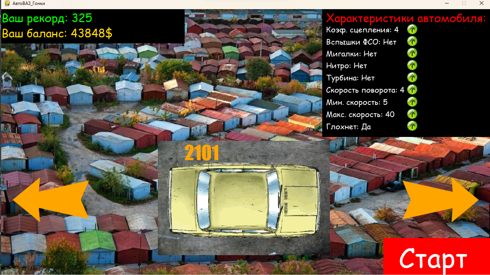
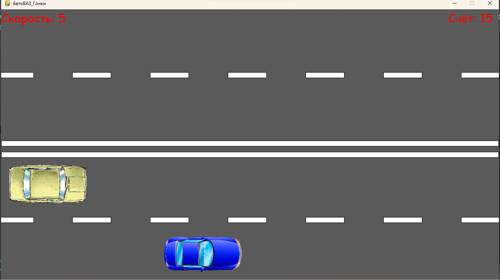
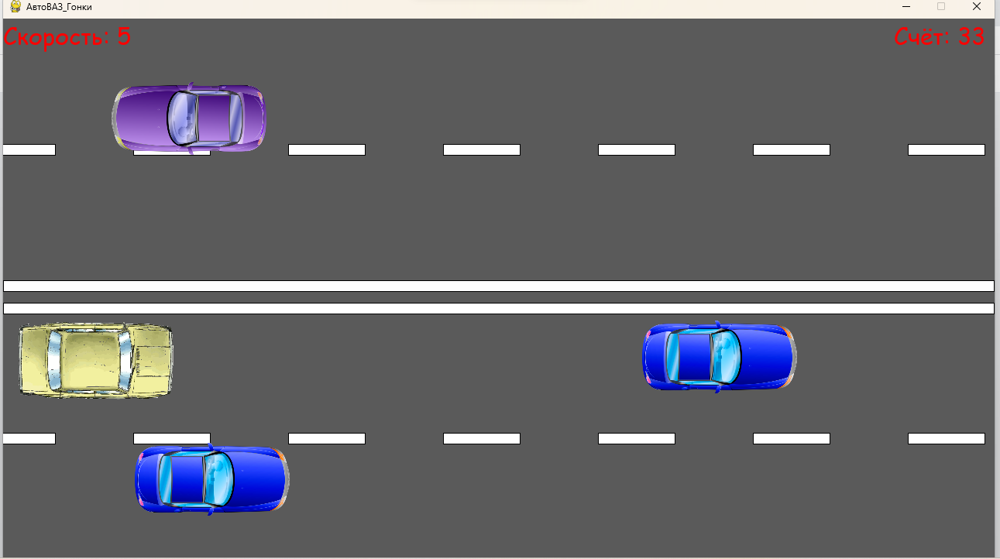
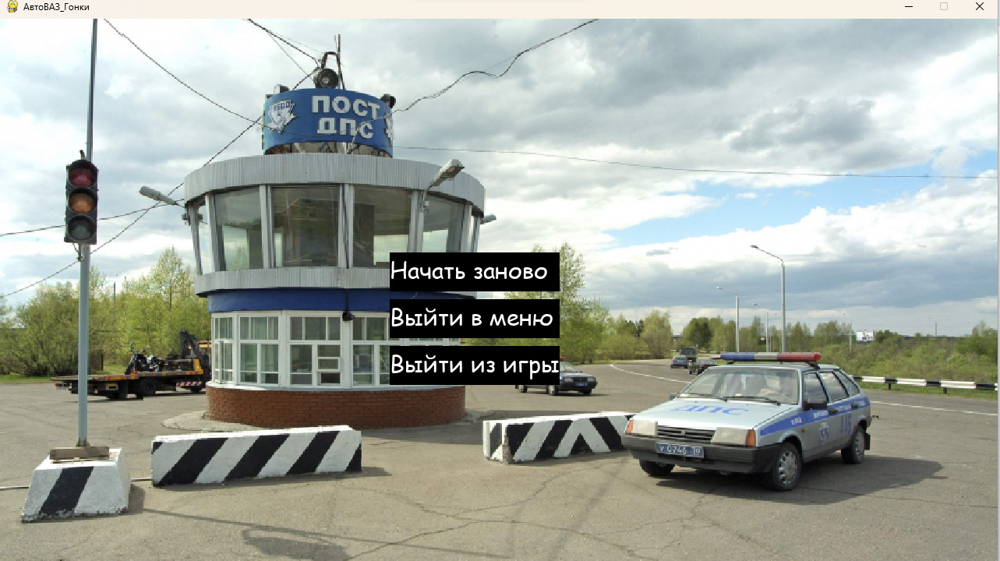

# АвтоВаз Racing
АвтоВаз Racing - это гоночная игра по 4-ех полосной дороге. Можно делать шашки,
пересекать двойную сплошную. И всё это на любимых отечественных автомобилях!

## Меню
В меню можно выбирать автомобили, ставить на них различный тюнинг.
Видно баланс, текущий рекорд на любом из автомобилей.

Можно покупать машинки.

## Геймплей
Управлять можно как со стрелочек, так и с WASD. Значение, на которое
 увеличивается счет, зависит от скорости авто.

На кнопку B можно бибикать как самосвал.

## Финальное окно
На финальном окне видим пост ДПС. Можно выйти в меню, из игры или
 начать гонку заново с тем же автомобилем, который был.

## Технологии
В основном используется Pygame. Для диалоговых окон - tkinter.

## Благодарности
Благодарим нашего преподавателя по Python за помощь.